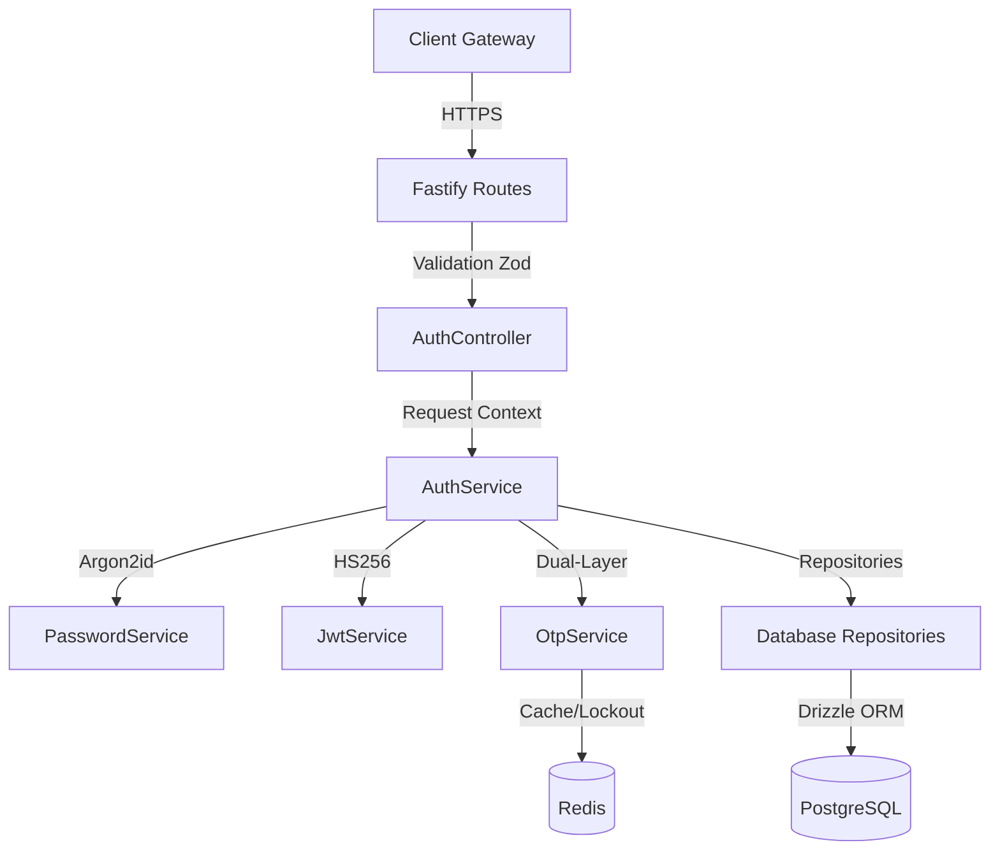
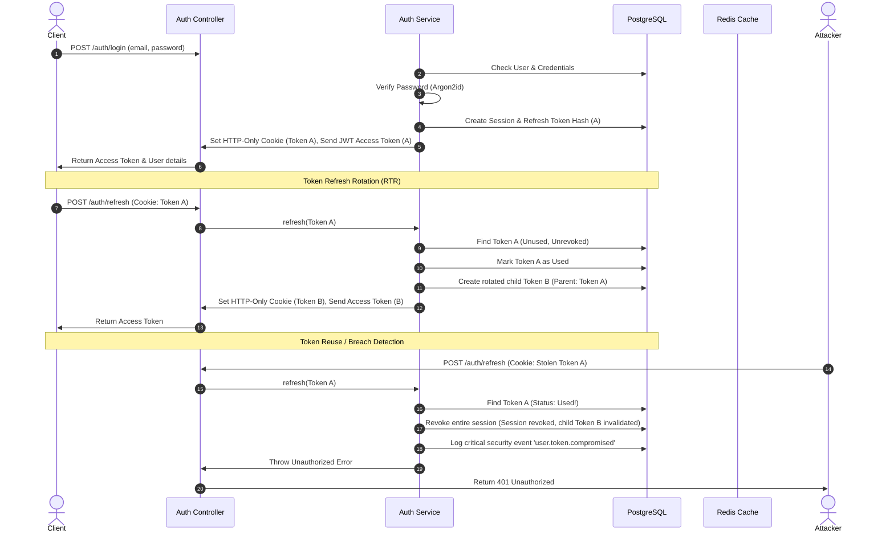
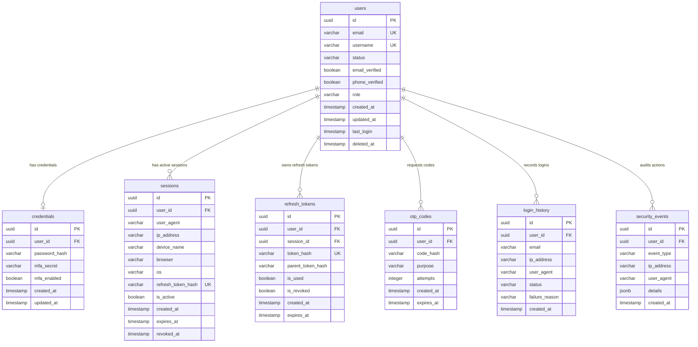

# AI Career OS — Authentication Service

The **Authentication Service** (`@ai-career-os/auth-service`) is the production-grade, central Identity Provider (IdP) for the AI Career OS microservices architecture. It provides secure credential management, stateless JWT access token generation, HTTP-only secure cookie refresh token rotation, active session/device auditing, and multi-layered protection against brute-force and credential stuffing attacks.

---

## 1. Authentication Architecture

The service follows clean architecture and DDD principles, isolating domain logic (services) from database queries (repositories) and transport protocols (controllers/Fastify routes).



---

## 2. JWT & Refresh Token Flow (RTR)

Access tokens are short-lived (15 minutes), stateless JWTs. Refresh tokens are long-lived (30 days), cryptographically secure random values stored as SHA-256 hashes in the database.

To protect against refresh token theft, we implement **Refresh Token Rotation (RTR)** with lineage tracking.



---

## 3. Database Schema

The database uses PostgreSQL managed via Drizzle ORM. Active lookups, expiration checks, and uniqueness parameters are optimized with custom B-Tree indexes.

### ER Diagram



---

## 4. API Documentation

All request parameters are validated at runtime against Zod schemas. Error envelopes follow the platform standard:

```json
{
  "success": false,
  "error": {
    "code": "VALIDATION_ERROR",
    "message": "Validation failed",
    "requestId": "4cfcb867-b50a-4a25-a13a-ff67f525d886",
    "timestamp": "2026-07-07T22:42:15.000Z",
    "details": [
      { "field": "email", "message": "Invalid email address format" }
    ]
  }
}
```

### Endpoints List

| Method | Endpoint | Description | Auth Required |
| :--- | :--- | :--- | :--- |
| **POST** | `/auth/register` | Register a new user account. Returns verification OTP in dev. | No |
| **POST** | `/auth/login` | Authenticate credentials. Returns access token & HTTP-only cookie. | No |
| **POST** | `/auth/logout` | Revokes the current session and clears the cookie. | No |
| **POST** | `/auth/refresh` | Rotates access token and child refresh token. | No |
| **POST** | `/auth/otp/request` | Dispatch a new OTP code (e.g. for registration, reset). | No |
| **POST** | `/auth/otp/verify` | Verify email OTP code and activate account. | No |
| **POST** | `/auth/forgot-password` | Initiates password reset flow by email. | No |
| **POST** | `/auth/reset-password` | Resets password using verification code. Revokes all sessions. | No |
| **GET** | `/auth/me` | Fetch active authenticated user profile details. | Yes (Bearer) |
| **POST** | `/auth/change-password` | Update current user's password. Revokes other sessions. | Yes (Bearer) |

---

## 5. Security Implementations

1. **Password Protection**:
   - Argon2id with memory cost `19MB` (`19456 KB`), iteration count `2`, parallelism factor `1`.
   - Strict strength policy: min length 8, 1 uppercase, 1 lowercase, 1 digit, 1 special character. Reject common password list.
2. **Brute Force & Lockout**:
   - Failed attempts tracked in Redis per email address.
   - Max 5 consecutive attempts, triggering a 15-minute temporary lockout.
3. **OTP Rate Limiting**:
   - Enforces a 60-second cooldown rate limit between consecutive OTP generation requests.
   - Max 3 attempts allowed for verifying any single code before invalidating it completely.
4. **Session Safety**:
   - Refresh tokens are hashed in DB to prevent theft via database leak.
   - Logging password changes or account locks revokes active sessions automatically.
