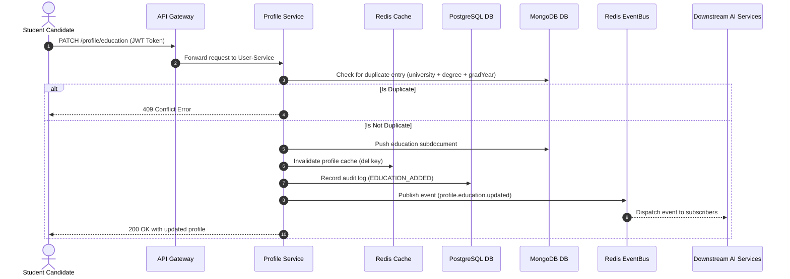
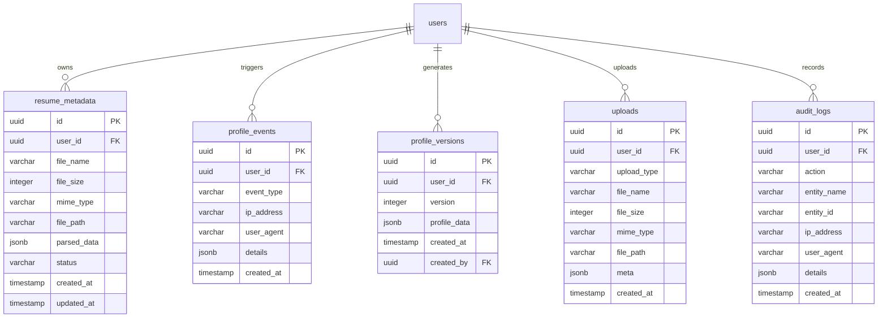

# Unified Student Profile Service

The **Unified Student Profile Service** acts as the single source of truth (SSOT) for every candidate's career identity within AI Career OS. It serves downstream AI modules, search engines, and portal integrations.

---

## Architectural Principles

1. **Domain-Driven Design (DDD)**: The Profile behaves as an aggregate root. All updates to education, experiences, certifications, projects, and career preferences flow through the `ProfileService` to enforce atomic validation.
2. **Repository Pattern**: Separates database concerns from business rules. Reads/updates to document data target MongoDB, while metadata, version history, audit logs, and file uploads target PostgreSQL.
3. **Event-Driven Architecture**: Mutating actions emit events to Redis Pub/Sub (configured for future Kafka streaming transitions) to trigger downstream AI processors.
4. **Cache-Aside Caching (Redis)**: Cache invalidation keeps read latency sub-5ms for `GET /profile/me` and completion computations.

---

## API Documentation

All routes expect a bearer JWT token to authenticate and extract the `userId` claim.

### ─── Profile Operations ───
- `GET /profile/me` — Fetches current user profile. Cached.
- `PATCH /profile` — Updates basic info, location, profile preferences. Invalidates cache.
- `GET /profile/completion` — Returns profile completion breakdown.

### ─── Profile Media ───
- `POST /profile/avatar` — Upload avatar metadata. Updates `basics.avatarUrl`.
- `DELETE /profile/avatar` — Remove avatar.
- `POST /profile/banner` — Upload banner cover metadata. Updates `basics.bannerUrl`.
- `DELETE /profile/banner` — Remove banner.

### ─── Education CRUD ───
- `POST /profile/education` — Add education milestone. Duplicate check: same university + degree + graduationYear.
- `PATCH /profile/education/:id` — Update education milestone.
- `DELETE /profile/education/:id` — Delete education milestone.

### ─── Experience CRUD ───
- `POST /profile/experience` — Add work experience entry.
- `PATCH /profile/experience/:id` — Update experience entry.
- `DELETE /profile/experience/:id` — Delete experience entry.

### ─── Projects CRUD ───
- `POST /profile/project` — Add technical project entry.
- `PATCH /profile/project/:id` — Update project entry.
- `DELETE /profile/project/:id` — Delete project entry.

### ─── Certifications CRUD ───
- `POST /profile/certification` — Add certificate. Duplicate check: same certificate name + issuer.
- `PATCH /profile/certification/:id` — Update certificate.
- `DELETE /profile/certification/:id` — Delete certificate.

### ─── Social Links ───
- `POST /profile/social-links` — Link social handles (GitHub, LinkedIn, Twitter, LeetCode, Kaggle).
- `PATCH /profile/social-links` — Update social handles.

### ─── Activity Timeline ───
- `GET /profile/activity` — Get historical timeline of profile and security events.

---

## Event Flow Diagram



---

## MongoDB Schema

```json
{
  "userId": "String (UUID, Unique Index)",
  "basics": {
    "name": "String",
    "headline": "String",
    "bio": "String",
    "phone": "String",
    "dateOfBirth": "String",
    "gender": "String",
    "avatarUrl": "String",
    "bannerUrl": "String"
  },
  "location": {
    "country": "String (Index)",
    "state": "String",
    "city": "String (Index)"
  },
  "education": [
    {
      "id": "String (UUID)",
      "university": "String (Index)",
      "degree": "String",
      "specialization": "String",
      "graduationYear": "String",
      "startDate": "String",
      "endDate": "String",
      "gpa": "String"
    }
  ],
  "experience": [
    {
      "id": "String (UUID)",
      "company": "String",
      "role": "String",
      "location": "String",
      "startDate": "String",
      "endDate": "String",
      "isCurrent": "Boolean",
      "description": "String"
    }
  ],
  "skills": ["String (Index)"],
  "languages": ["String (Index)"],
  "projects": [
    {
      "id": "String (UUID)",
      "title": "String",
      "description": "String",
      "technologies": ["String (Index)"],
      "url": "String",
      "githubUrl": "String"
    }
  ],
  "certifications": [
    {
      "id": "String (UUID)",
      "name": "String",
      "issuer": "String",
      "issueDate": "String",
      "expiryDate": "String",
      "credentialId": "String",
      "credentialUrl": "String"
    }
  ],
  "careerPreferences": {
    "careerGoal": "String",
    "preferredRoles": ["String (Index)"],
    "employmentType": "String",
    "expectedSalary": "String",
    "preferredLocations": ["String (Index)"],
    "workMode": "String",
    "availability": "String"
  },
  "socialLinks": {
    "github": "String",
    "linkedin": "String",
    "twitter": "String",
    "portfolio": "String",
    "website": "String",
    "kaggle": "String",
    "leetcode": "String"
  },
  "preferences": {
    "profileVisibility": "String ('public' | 'private' | 'recruiters')",
    "searchEngineIndexing": "Boolean",
    "recruiterDiscovery": "Boolean",
    "notifications": "Map"
  }
}
```

---

## PostgreSQL ER Diagram


