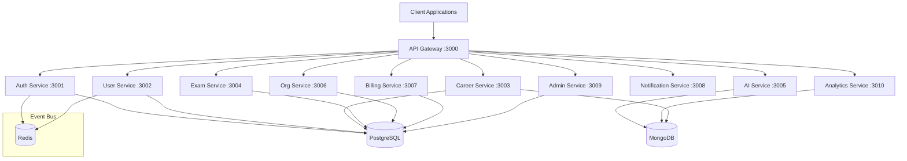

# Architecture Overview

## System Architecture

AI Career OS is built as a **distributed microservices platform** following industry best practices from Google, Netflix, and Stripe.



## Architectural Principles

### 1. Clean Architecture
Each service follows the dependency inversion principle:
- **Controllers** → Handle HTTP
- **Services** → Business logic
- **Repositories** → Data access
- **Entities** → Domain models

Dependencies point inward — business logic never depends on frameworks or databases.

### 2. Domain-Driven Design
Each service represents a **Bounded Context**:
- Auth → Identity & Access
- User → User Profiles
- Career → Career Intelligence
- Exam → Assessments
- AI → Machine Learning
- Organization → Multi-tenancy
- Billing → Payments
- Notification → Communication
- Admin → Platform Admin
- Analytics → Data Intelligence

### 3. Event-Driven Communication
Services communicate through events via Redis Pub/Sub (future: Kafka):
- **User Created** → Notification Service sends welcome email
- **Resume Uploaded** → AI Service triggers analysis
- **Payment Succeeded** → Billing Service activates subscription

### 4. API Gateway Pattern
The Gateway service handles:
- Request routing
- Rate limiting
- CORS
- Request/Response logging
- Correlation ID propagation

### 5. Observability
- **Structured JSON logging** (Pino / structlog)
- **Correlation IDs** across all service calls
- **Request ID** propagation
- **Health checks** (liveness + readiness probes)

## Data Architecture

| Database | Use Case | Services |
|----------|----------|----------|
| **PostgreSQL** | Relational data, transactions, ACID compliance | Auth, User, Career, Exam, Org, Billing, Admin |
| **MongoDB** | Unstructured data, documents, flexible schemas | AI, Analytics, Career (documents) |
| **Redis** | Caching, sessions, event pub/sub, rate limiting | All services |

## Security Architecture

| Layer | Mechanism |
|-------|-----------|
| **Transport** | HTTPS (TLS termination at load balancer) |
| **Headers** | Helmet.js security headers |
| **CORS** | Restricted origin whitelist |
| **Rate Limiting** | Per-IP sliding window |
| **Input Validation** | Zod / Pydantic schema validation |
| **Authentication** | JWT tokens (future implementation) |
| **Authorization** | RBAC with role hierarchy |
| **Secrets** | Environment variables (future: Vault/Secrets Manager) |
| **Logging** | Sensitive field redaction |

## Deployment Architecture (Target)

```
┌──────────────────────────────────────────┐
│              AWS Cloud                    │
│  ┌────────────────────────────────────┐  │
│  │         Application Load           │  │
│  │            Balancer                 │  │
│  └──────────────┬─────────────────────┘  │
│                 │                         │
│  ┌──────────────▼─────────────────────┐  │
│  │        Amazon EKS (Kubernetes)     │  │
│  │  ┌────────┐ ┌────────┐ ┌────────┐ │  │
│  │  │Gateway │ │Auth Svc│ │User Svc│ │  │
│  │  │ Pods   │ │ Pods   │ │ Pods   │ │  │
│  │  └────────┘ └────────┘ └────────┘ │  │
│  │  ┌────────┐ ┌────────┐ ┌────────┐ │  │
│  │  │Career  │ │AI Svc  │ │Billing │ │  │
│  │  │ Pods   │ │ Pods   │ │ Pods   │ │  │
│  │  └────────┘ └────────┘ └────────┘ │  │
│  └────────────────────────────────────┘  │
│                                          │
│  ┌────────────────────────────────────┐  │
│  │      Managed Data Services         │  │
│  │  ┌──────┐ ┌──────┐ ┌────────────┐ │  │
│  │  │ RDS  │ │DocDB │ │ElastiCache │ │  │
│  │  │(PG)  │ │(Mongo│ │  (Redis)   │ │  │
│  │  └──────┘ └──────┘ └────────────┘ │  │
│  └────────────────────────────────────┘  │
└──────────────────────────────────────────┘
```
