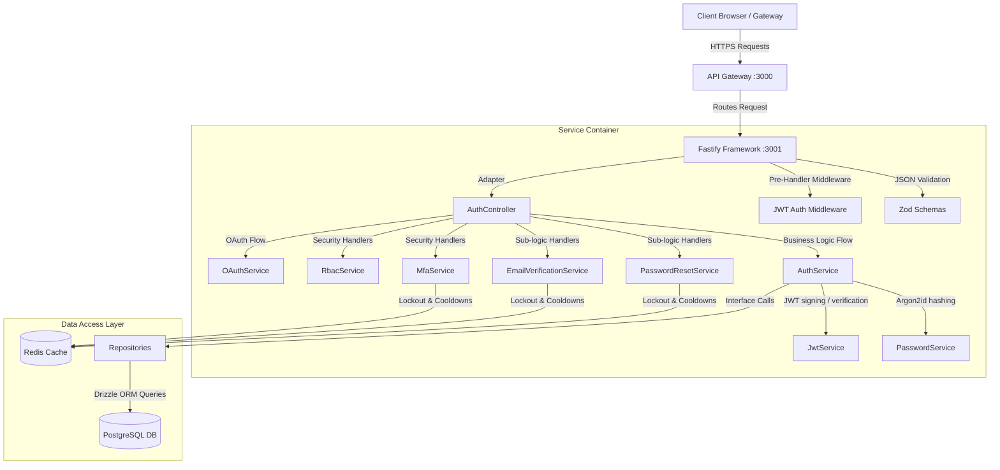
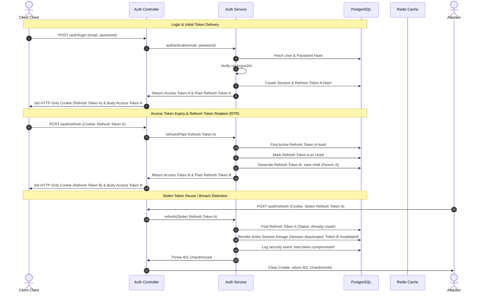
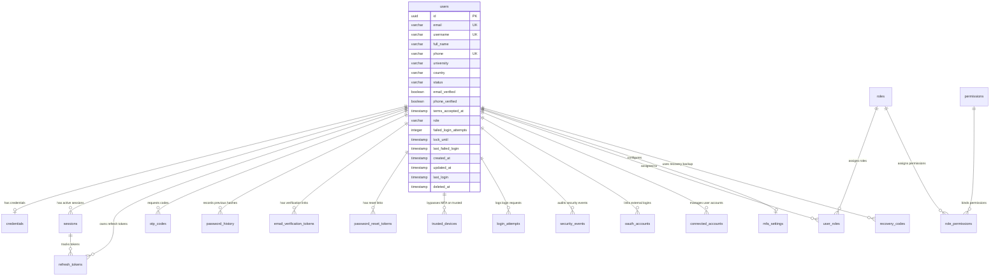

# AI Career OS — Authentication & Authorization Service

This document provides a comprehensive overview of the **Authentication & Authorization Service** (`@ai-career-os/auth-service`), which serves as the production-grade Identity Provider (IdP) for the AI Career OS microservices platform. It details the service's purpose, system architecture, database schema, data types, and API design.

---

## 1. Executive Summary & Purpose

The **Authentication Service** is a centralized security boundary designed to manage candidate and administrator identities, regulate access control via Role-Based Access Control (RBAC), and defend the platform against malicious access, credentials compromise, and automated stuffing/brute-force attacks.

### Key Security & Functional Standards
*   **OWASP ASVS §2.1 Compliance**: Enforces rigorous password complexity, checks against common password dictionaries, and restricts password reuse.
*   **NIST SP 800-63B Guidelines**: Implements password length requirements (minimum 12 characters, maximum 128 characters to prevent Argon2 DoS attacks).
*   **Refresh Token Rotation (RTR)**: Features a state-of-the-art token rotation flow with lineage tracking to detect and revoke stolen sessions.
*   **Multi-Factor Authentication (MFA)**: Supports Time-Based One-Time Passwords (TOTP via Google Authenticator/Authy) and Email-based MFA.
*   **OAuth 2.0 Integration**: Implements federated logins for Google, GitHub, Microsoft, and LinkedIn with dynamic linking/unlinking.
*   **Auditability & Compliance (SOC 2 / ISO 27001)**: Implements append-only security logs, active session tracking, and trusted device fingerprinting.

---

## 2. System Architecture

The authentication service follows **Clean Architecture** and **Domain-Driven Design (DDD)** principles, separating HTTP concerns from domain logic and data access.

### Component Layering


### JWT Access & Refresh Token Flow with RTR
The platform uses short-lived stateless JWT access tokens (15 minutes) and long-lived refresh tokens (30 days). The refresh tokens are rotation-tracked using SHA-256 hashes in PostgreSQL to support Refresh Token Rotation (RTR).



---

## 3. Database Schema

The relational database layer is built on PostgreSQL and queried using **Drizzle ORM**. Performance is optimized via customized B-Tree composite and unique indexes.

### Entity Relationship Diagram


### Table Definitions & Specifications

#### 1. `users`
Represents the core user record containing primary profile meta and system-level lockouts.
*   **Drizzle Definition**:
    ```typescript
    export const users = pgTable('users', {
      id: uuid('id').primaryKey().defaultRandom(),
      email: varchar('email', { length: 255 }).notNull(),
      username: varchar('username', { length: 100 }).notNull(),
      fullName: varchar('full_name', { length: 200 }),
      phone: varchar('phone', { length: 20 }),
      university: varchar('university', { length: 255 }),
      country: varchar('country', { length: 100 }),
      status: varchar('status', { length: 50 }).notNull().default('pending_verification'),
      emailVerified: boolean('email_verified').notNull().default(false),
      phoneVerified: boolean('phone_verified').notNull().default(false),
      termsAcceptedAt: timestamp('terms_accepted_at', { withTimezone: true }),
      role: varchar('role', { length: 50 }).notNull().default('candidate'),
      failedLoginAttempts: integer('failed_login_attempts').notNull().default(0),
      lockUntil: timestamp('lock_until', { withTimezone: true }),
      lastFailedLogin: timestamp('last_failed_login', { withTimezone: true }),
      createdAt: timestamp('created_at', { withTimezone: true }).notNull().defaultNow(),
      updatedAt: timestamp('updated_at', { withTimezone: true }).notNull().defaultNow(),
      lastLogin: timestamp('last_login', { withTimezone: true }),
      deletedAt: timestamp('deleted_at', { withTimezone: true }),
    });
    ```
*   **Indexes**:
    *   `users_email_unique_idx` (Unique B-Tree on `email`)
    *   `users_username_unique_idx` (Unique B-Tree on `username`)
    *   `users_phone_unique_idx` (Unique B-Tree on `phone`)
    *   `users_role_idx` (B-Tree on `role`)
    *   `users_status_idx` (B-Tree on `status`)

#### 2. `credentials`
Contains Argon2id password hashes and Multi-Factor Authenticator seed keys.
*   **Drizzle Definition**:
    ```typescript
    export const credentials = pgTable('credentials', {
      id: uuid('id').primaryKey().defaultRandom(),
      userId: uuid('user_id').references(() => users.id, { onDelete: 'cascade' }).notNull(),
      passwordHash: varchar('password_hash', { length: 255 }).notNull(),
      mfaSecret: varchar('mfa_secret', { length: 255 }),
      mfaEnabled: boolean('mfa_enabled').notNull().default(false),
      createdAt: timestamp('created_at', { withTimezone: true }).notNull().defaultNow(),
      updatedAt: timestamp('updated_at', { withTimezone: true }).notNull().defaultNow(),
    });
    ```
*   **Indexes**:
    *   `credentials_user_id_unique_idx` (Unique B-Tree on `userId`)

#### 3. `sessions`
Tracks active user session contexts (device, OS, IP address, etc.).
*   **Drizzle Definition**:
    ```typescript
    export const sessions = pgTable('sessions', {
      id: uuid('id').primaryKey().defaultRandom(),
      userId: uuid('user_id').references(() => users.id, { onDelete: 'cascade' }).notNull(),
      userAgent: varchar('user_agent', { length: 512 }),
      ipAddress: varchar('ip_address', { length: 45 }),
      deviceName: varchar('device_name', { length: 255 }),
      browser: varchar('browser', { length: 100 }),
      os: varchar('os', { length: 100 }),
      location: varchar('location', { length: 255 }),
      refreshTokenHash: varchar('refresh_token_hash', { length: 255 }).notNull(),
      isActive: boolean('is_active').notNull().default(true),
      lastActivityAt: timestamp('last_activity_at', { withTimezone: true }).notNull().defaultNow(),
      createdAt: timestamp('created_at', { withTimezone: true }).notNull().defaultNow(),
      expiresAt: timestamp('expires_at', { withTimezone: true }).notNull(),
      revokedAt: timestamp('revoked_at', { withTimezone: true }),
    });
    ```
*   **Indexes**:
    *   `sessions_user_id_idx` (B-Tree on `userId`)
    *   `sessions_refresh_token_hash_unique_idx` (Unique B-Tree on `refreshTokenHash`)
    *   `sessions_active_idx` (Composite B-Tree on `userId`, `isActive`)

#### 4. `refresh_tokens`
Stores SHA-256 hashed refresh tokens for RTR tracking.
*   **Drizzle Definition**:
    ```typescript
    export const refreshTokens = pgTable('refresh_tokens', {
      id: uuid('id').primaryKey().defaultRandom(),
      userId: uuid('user_id').references(() => users.id, { onDelete: 'cascade' }).notNull(),
      sessionId: uuid('session_id').references(() => sessions.id, { onDelete: 'cascade' }).notNull(),
      tokenHash: varchar('token_hash', { length: 255 }).notNull(),
      parentTokenHash: varchar('parent_token_hash', { length: 255 }),
      isUsed: boolean('is_used').notNull().default(false),
      isRevoked: boolean('is_revoked').notNull().default(false),
      createdAt: timestamp('created_at', { withTimezone: true }).notNull().defaultNow(),
      expiresAt: timestamp('expires_at', { withTimezone: true }).notNull(),
    });
    ```
*   **Indexes**:
    *   `refresh_tokens_token_hash_unique_idx` (Unique B-Tree on `tokenHash`)
    *   `refresh_tokens_user_id_idx` (B-Tree on `userId`)
    *   `refresh_tokens_session_id_idx` (B-Tree on `sessionId`)

#### 5. `otp_codes`
Stores temporary verification OTP hashes.
*   **Drizzle Definition**:
    ```typescript
    export const otpCodes = pgTable('otp_codes', {
      id: uuid('id').primaryKey().defaultRandom(),
      userId: uuid('user_id').references(() => users.id, { onDelete: 'cascade' }).notNull(),
      codeHash: varchar('code_hash', { length: 255 }).notNull(),
      purpose: varchar('purpose', { length: 50 }).notNull(),
      attempts: integer('attempts').notNull().default(0),
      isUsed: boolean('is_used').notNull().default(false),
      createdAt: timestamp('created_at', { withTimezone: true }).notNull().defaultNow(),
      expiresAt: timestamp('expires_at', { withTimezone: true }).notNull(),
    });
    ```
*   **Indexes**:
    *   `otp_codes_user_id_purpose_idx` (Composite B-Tree on `userId`, `purpose`)

#### 6. `password_history`
Enforces OWASP password recycling guidelines by storing a history of previous hashes.
*   **Drizzle Definition**:
    ```typescript
    export const passwordHistory = pgTable('password_history', {
      id: uuid('id').primaryKey().defaultRandom(),
      userId: uuid('user_id').references(() => users.id, { onDelete: 'cascade' }).notNull(),
      passwordHash: varchar('password_hash', { length: 255 }).notNull(),
      createdAt: timestamp('created_at', { withTimezone: true }).notNull().defaultNow(),
    });
    ```
*   **Indexes**:
    *   `password_history_user_id_idx` (B-Tree on `userId`)
    *   `password_history_created_at_idx` (B-Tree on `createdAt`)

#### 7. `email_verification_tokens`
Stores hashed one-time tokens for email verification links.
*   **Drizzle Definition**:
    ```typescript
    export const emailVerificationTokens = pgTable('email_verification_tokens', {
      id: uuid('id').primaryKey().defaultRandom(),
      userId: uuid('user_id').references(() => users.id, { onDelete: 'cascade' }).notNull(),
      tokenHash: varchar('token_hash', { length: 255 }).notNull(),
      expiresAt: timestamp('expires_at', { withTimezone: true }).notNull(),
      usedAt: timestamp('used_at', { withTimezone: true }),
      createdAt: timestamp('created_at', { withTimezone: true }).notNull().defaultNow(),
    });
    ```

#### 8. `password_reset_tokens`
Stores hashed recovery links for forgot-password triggers.
*   **Drizzle Definition**:
    ```typescript
    export const passwordResetTokens = pgTable('password_reset_tokens', {
      id: uuid('id').primaryKey().defaultRandom(),
      userId: uuid('user_id').references(() => users.id, { onDelete: 'cascade' }).notNull(),
      tokenHash: varchar('token_hash', { length: 255 }).notNull(),
      expiresAt: timestamp('expires_at', { withTimezone: true }).notNull(),
      usedAt: timestamp('used_at', { withTimezone: true }),
      createdAt: timestamp('created_at', { withTimezone: true }).notNull().defaultNow(),
    });
    ```

#### 9. `trusted_devices`
Tracks cryptographic footprints of devices verified via MFA.
*   **Drizzle Definition**:
    ```typescript
    export const trustedDevices = pgTable('trusted_devices', {
      id: uuid('id').primaryKey().defaultRandom(),
      userId: uuid('user_id').references(() => users.id, { onDelete: 'cascade' }).notNull(),
      deviceFingerprint: varchar('device_fingerprint', { length: 255 }).notNull(),
      deviceName: varchar('device_name', { length: 255 }),
      deviceNickname: varchar('device_nickname', { length: 255 }),
      browser: varchar('browser', { length: 100 }),
      os: varchar('os', { length: 100 }),
      ipAddress: varchar('ip_address', { length: 45 }),
      lastUsedAt: timestamp('last_used_at', { withTimezone: true }).notNull().defaultNow(),
      lastActiveAt: timestamp('last_active_at', { withTimezone: true }).notNull().defaultNow(),
      expiresAt: timestamp('expires_at', { withTimezone: true }).notNull(),
      createdAt: timestamp('created_at', { withTimezone: true }).notNull().defaultNow(),
    });
    ```
*   **Indexes**:
    *   `trusted_devices_user_id_idx` (B-Tree on `userId`)
    *   `trusted_devices_fingerprint_idx` (Unique B-Tree on `userId`, `deviceFingerprint`)

#### 10. `login_attempts`
Records precise records of all logins for security profiling.
*   **Drizzle Definition**:
    ```typescript
    export const loginAttempts = pgTable('login_attempts', {
      id: uuid('id').primaryKey().defaultRandom(),
      userId: uuid('user_id').references(() => users.id, { onDelete: 'cascade' }),
      email: varchar('email', { length: 255 }),
      ipAddress: varchar('ip_address', { length: 45 }),
      userAgent: varchar('user_agent', { length: 512 }),
      status: varchar('status', { length: 50 }).notNull(),
      failureReason: varchar('failure_reason', { length: 255 }),
      attemptNumber: integer('attempt_number'),
      createdAt: timestamp('created_at', { withTimezone: true }).notNull().defaultNow(),
    });
    ```

#### 11. `security_events` (Append-Only Audit Log)
Stores platform-level changes (password revisions, locks, token breaches) for compliance.
*   **Drizzle Definition**:
    ```typescript
    export const securityEvents = pgTable('security_events', {
      id: uuid('id').primaryKey().defaultRandom(),
      userId: uuid('user_id').references(() => users.id, { onDelete: 'cascade' }),
      eventType: varchar('event_type', { length: 100 }).notNull(),
      ipAddress: varchar('ip_address', { length: 45 }),
      userAgent: varchar('user_agent', { length: 512 }),
      details: jsonb('details').notNull().default({}),
      createdAt: timestamp('created_at', { withTimezone: true }).notNull().defaultNow(),
    });
    ```

#### 12. `oauth_accounts` & `connected_accounts`
Maps federated logins.
*   **Drizzle Definition**:
    ```typescript
    export const oauthAccounts = pgTable('oauth_accounts', {
      id: uuid('id').primaryKey().defaultRandom(),
      userId: uuid('user_id').references(() => users.id, { onDelete: 'cascade' }).notNull(),
      provider: varchar('provider', { length: 50 }).notNull(),
      providerUserId: varchar('provider_user_id', { length: 255 }).notNull(),
      providerEmail: varchar('provider_email', { length: 255 }),
      createdAt: timestamp('created_at', { withTimezone: true }).notNull().defaultNow(),
      updatedAt: timestamp('updated_at', { withTimezone: true }).notNull().defaultNow(),
    });
    ```

#### 13. RBAC System (`roles`, `permissions`, `role_permissions`, `user_roles`)
Stores fine-grained permissions.
*   **Drizzle Definitions**:
    ```typescript
    export const roles = pgTable('roles', {
      id: uuid('id').primaryKey().defaultRandom(),
      name: varchar('name', { length: 100 }).notNull(),
      description: varchar('description', { length: 255 }),
      createdAt: timestamp('created_at', { withTimezone: true }).notNull().defaultNow(),
      updatedAt: timestamp('updated_at', { withTimezone: true }).notNull().defaultNow(),
    });

    export const permissions = pgTable('permissions', {
      id: uuid('id').primaryKey().defaultRandom(),
      name: varchar('name', { length: 100 }).notNull(),
      description: varchar('description', { length: 255 }),
      createdAt: timestamp('created_at', { withTimezone: true }).notNull().defaultNow(),
      updatedAt: timestamp('updated_at', { withTimezone: true }).notNull().defaultNow(),
    });

    export const rolePermissions = pgTable('role_permissions', {
      roleId: uuid('role_id').references(() => roles.id, { onDelete: 'cascade' }).notNull(),
      permissionId: uuid('permission_id').references(() => permissions.id, { onDelete: 'cascade' }).notNull(),
    }, (table) => ({
      pk: primaryKey({ columns: [table.roleId, table.permissionId] }),
    }));

    export const userRoles = pgTable('user_roles', {
      userId: uuid('user_id').references(() => users.id, { onDelete: 'cascade' }).notNull(),
      roleId: uuid('role_id').references(() => roles.id, { onDelete: 'cascade' }).notNull(),
    }, (table) => ({
      pk: primaryKey({ columns: [table.userId, table.roleId] }),
    }));
    ```

#### 14. `mfa_settings` & `recovery_codes`
Configures authentication verification preferences and fallback codes.
*   **Drizzle Definitions**:
    ```typescript
    export const mfaSettings = pgTable('mfa_settings', {
      id: uuid('id').primaryKey().defaultRandom(),
      userId: uuid('user_id').references(() => users.id, { onDelete: 'cascade' }).notNull(),
      emailEnabled: boolean('email_enabled').notNull().default(false),
      totpEnabled: boolean('totp_enabled').notNull().default(false),
      totpSecret: varchar('totp_secret', { length: 255 }),
      smsEnabled: boolean('sms_enabled').notNull().default(false),
      smsPhone: varchar('sms_phone', { length: 50 }),
      createdAt: timestamp('created_at', { withTimezone: true }).notNull().defaultNow(),
      updatedAt: timestamp('updated_at', { withTimezone: true }).notNull().defaultNow(),
    });

    export const recoveryCodes = pgTable('recovery_codes', {
      id: uuid('id').primaryKey().defaultRandom(),
      userId: uuid('user_id').references(() => users.id, { onDelete: 'cascade' }).notNull(),
      codeHash: varchar('code_hash', { length: 255 }).notNull(),
      isUsed: boolean('is_used').notNull().default(false),
      usedAt: timestamp('used_at', { withTimezone: true }),
      createdAt: timestamp('created_at', { withTimezone: true }).notNull().defaultNow(),
    });
    ```

---

## 4. Shared Domain Types & Interfaces

The type definitions reside in `@ai-career-os/types` for platform-wide import.

```typescript
export enum UserRole {
  STUDENT = 'student',
  PROFESSIONAL = 'professional',
  RECRUITER = 'recruiter',
  ORGANIZATION_ADMIN = 'organization_admin',
  UNIVERSITY_ADMIN = 'university_admin',
  PLATFORM_ADMIN = 'platform_admin',
  SUPER_ADMIN = 'super_admin',
  CANDIDATE = 'candidate',
  MENTOR = 'mentor',
  ORGANIZATION_MANAGER = 'organization_manager',
  ADMINISTRATOR = 'administrator',
  SUPER_ADMINISTRATOR = 'super_administrator',
}

export enum AuthProvider {
  LOCAL = 'local',
  GOOGLE = 'google',
  GITHUB = 'github',
  LINKEDIN = 'linkedin',
  MICROSOFT = 'microsoft',
}

export interface TokenPayload {
  readonly sub: string;
  readonly email: string;
  readonly roles: UserRole[];
  readonly organizationId?: string;
  readonly sessionId: string;
  readonly iat: number;
  readonly exp: number;
}

export interface AuthTokens {
  readonly accessToken: string;
  readonly refreshToken: string;
  readonly expiresIn: number;
  readonly tokenType: 'Bearer';
}

export interface UserProfile {
  readonly id: string;
  readonly email: string;
  readonly firstName: string;
  readonly lastName: string;
  readonly displayName: string;
  readonly avatarUrl?: string;
  readonly bio?: string;
  readonly roles: string[];
  readonly organizationId?: string;
  readonly isActive: boolean;
  readonly isVerified: boolean;
  readonly createdAt: string;
  readonly updatedAt: string;
}
```

---

## 5. API Design & Endpoints

All responses follow a standard envelope schema:
*   **Success Response**:
    ```json
    {
      "success": true,
      "data": { ... },
      "requestId": "5e1a74d2-d851-4043-9828-9844837a28e8"
    }
    ```
*   **Error Response**:
    ```json
    {
      "success": false,
      "error": {
        "code": "VALIDATION_ERROR",
        "message": "Validation failed",
        "requestId": "4cfcb867-b50a-4a25-a13a-ff67f525d886",
        "timestamp": "2026-07-07T22:42:15.000Z",
        "details": [{ "field": "password", "message": "Password must be at least 12 characters long" }]
      }
    }
    ```

### Route Index Table

| Method | Route Path | Description | Access Protection |
|:---|:---|:---|:---|
| **POST** | `/auth/register` | Registers candidate account. Returns mock code in dev mode. | Public |
| **POST** | `/auth/login` | Validates credentials. Sets Http-Only refresh cookie. | Public |
| **POST** | `/auth/logout` | Revokes the current refresh session and clears cookie. | Public |
| **POST** | `/auth/refresh` | Consumes HTTP-Only refresh token to issue a rotated pair. | Public |
| **POST** | `/auth/forgot-password` | Dispatches reset token over email if email exists. | Public |
| **POST** | `/auth/reset-password` | Resets user password. Revokes active sessions. | Public |
| **POST** | `/auth/verify-email` | Consumes verification token to verify account email. | Public |
| **POST** | `/auth/resend-verification` | Resends verification token email. | Public |
| **POST** | `/auth/logout-all` | Terminates all user sessions. | Protected (Bearer) |
| **POST** | `/auth/change-password` | Changes password. Invalidates other sessions. | Protected (Bearer) |
| **GET** | `/auth/me` | Fetches active profile of authenticated user. | Protected (Bearer) |
| **GET** | `/auth/sessions` | Lists all active active session metadata logs. | Protected (Bearer) |
| **DELETE** | `/auth/sessions/:id` | Revokes a target session ID. | Protected (Bearer) |
| **POST** | `/auth/oauth/:provider` | Initiates OAuth flow (Google, GitHub, MS, LinkedIn). | Public |
| **GET** | `/auth/oauth/callback` | Callback redirected code processor. Redirection output. | Public |
| **POST** | `/auth/oauth/unlink` | Breaks link with active OAuth provider. | Protected (Bearer) |
| **GET** | `/auth/oauth/providers` | Retrieves current list of federated providers. | Protected (Bearer) |
| **POST** | `/auth/mfa/enable` | Activates MFA setting and issues recovery codes. | Protected (Bearer) |
| **POST** | `/auth/mfa/verify` | Completes code verification during login/activation. | Public / Optional |
| **POST** | `/auth/mfa/disable` | Disables MFA configurations. | Protected (Bearer) |
| **POST** | `/auth/mfa/recovery-codes/rotate` | Rotates the recovery backup seeds. | Protected (Bearer) |
| **GET** | `/auth/security/events` | Retrieves user audit trails logs history. | Protected (Bearer) |
| **GET** | `/auth/devices` | Compiles trusted device fingerprints and sessions. | Protected (Bearer) |
| **DELETE** | `/auth/devices/:id` | Revokes access for a trusted device fingerprint. | Protected (Bearer) |
| **POST** | `/auth/delete-account` | Initiates cascade user soft/hard deletion. | Protected (Bearer) |
| **GET** | `/auth/permissions` | Lists roles and system configurations. | Protected (Bearer) |
| **GET** | `/auth/roles` | Fetches user roles. | Protected (Bearer) |

---

## 6. Request Payloads & Validation (Zod Schemas)

### User Registration
*   **Validator**: `registerSchema`
*   **JSON Schema**:
    ```typescript
    export const registerSchema = z.object({
      email: z.string().email('Invalid email address format').max(255),
      username: z.string().min(6).max(50).regex(/^[a-zA-Z0-9_\-]+$/),
      password: PASSWORD_SCHEMA,
      confirmPassword: z.string(),
      fullName: z.string().min(2).max(200).optional(),
      phone: z.string().min(7).max(20).optional(),
      university: z.string().max(255).optional(),
      country: z.string().max(100).optional(),
      termsAccepted: z.boolean().optional(),
      role: z.nativeEnum(UserRole).default(UserRole.CANDIDATE),
    }).refine((data) => data.password === data.confirmPassword, {
      message: 'Passwords do not match',
      path: ['confirmPassword']
    });
    ```

### User Login
*   **Validator**: `loginSchema`
*   **JSON Schema**:
    ```typescript
    export const loginSchema = z.object({
      email: z.string().email('Invalid email address format'),
      password: z.string().min(1, 'Password is required'),
      rememberMe: z.boolean().optional().default(false),
    });
    ```

### MFA Verification
*   **Validator**: `mfaVerifySchema`
*   **JSON Schema**:
    ```typescript
    export const mfaVerifySchema = z.object({
      code: z.string().min(4).max(20),
      tempToken: z.string().optional(), // Provided for unauthenticated login transitions
    });
    ```

---

## 7. Security Hardening Configurations

1.  **Brute-Force & Lockouts**:
    *   Emails are rate-limited via sliding windows stored in Redis.
    *   Maximum of **5 failed login attempts** triggers a **15-minute lockout** window.
2.  **Argon2id Hash Configurations**:
    *   Memory cost: `19,456 KB` (19 MB).
    *   Iterations: `2`.
    *   Parallelism: `1`.
3.  **Transport & Storage Security**:
    *   Cookies are flagged `httpOnly: true`, `secure: true` (in production), and `sameSite: "lax"`.
    *   Paths are constrained to `/auth` prefix, ensuring client browser isolation.
    *   Tokens (both OTP codes and password reset links) are stored in the database exclusively as **SHA-256 hashes**.
